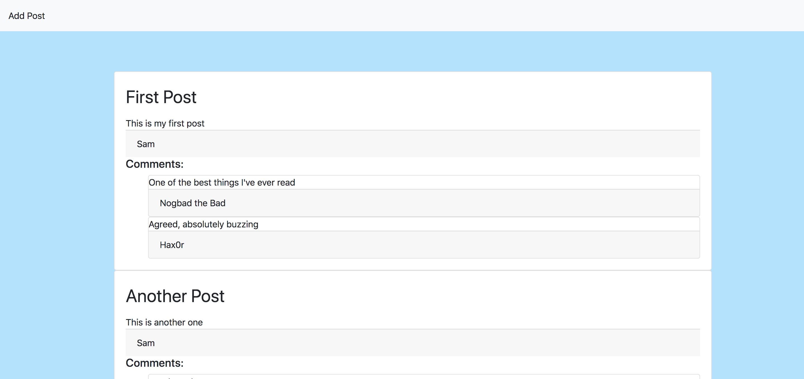
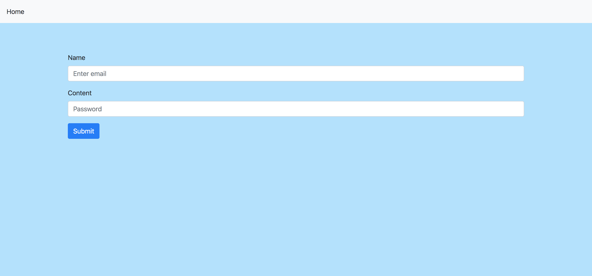

# DB Challenge: Message Board App

Your challenge is to build a web app that will function as a message board. Posts should be persisted in a database.

## Basic Functionality
- A user should be able to fill in a form, providing their name and a message.
- Once the form has been submitted, their post should be displayed on the main page.
- All posts should be displayed in reverse chronological order

## Advanced functionality
- Users should have the option to comment on existing posts.
- Comments should appear below the post they are responding to.

# Stretch goal
- Add authentication to the app - users should be asked to register and log in prior to posting or leaving comments.
- Users should be able to edit or delete their own posts or comments, but not those belonging to others.

## Proposed screens:

Here are some suggested screens, but feel free to change the content, style and flow to make it your own.

