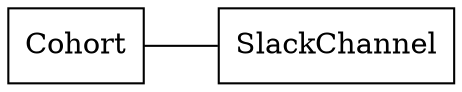
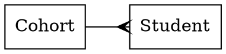
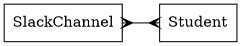
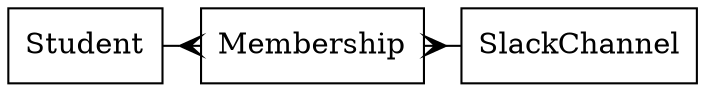

Entity Relationship Diagrams
============================

## Learn to

* Represent domain relationships with entity relationship diagrams

## Introduction

### One to one relationships

One `Cohort` has one `SlackChannel`.



```ruby
class Cohort
  def initialize(name, slack_channel)
    @name = name
    @slack_channel = slack_channel
  end

  attr_reader :name, :slack_channel
end

class SlackChannel
  def initialize(name)
    @name = name
  end

  attr_reader :name
end

slack_channel = SlackChannel.new("blue-july2017")
cohort = Cohort.new("Blue July 2017", slack_channel)
```

### One to many relationships

One `Cohort` has many `Students`.



```ruby
class Cohort
  def initialize(name, students)
    @name = name
    @students = students
  end

  attr_reader :name, :students
end

class Student
  def initialize(name)
    @name = name
  end
end

students = [
  Student.new("Fred"),
  Student.new("George")
]
cohort = Cohort.new("Blue July 2017", students)
```

## Exercise 1

Diagram the following:

Slack has many organisations. Each organisation has many Slack channels. Each organisation has one owner.

## Exercise 2

Diagram one or more of the following, with as much imagination as you like:

* Slack
* Makers Academy
* The Kitchen

## Intermezzo: Many to many relationships

A `SlackChannel` has many `Students`.
A `Student` has many `SlackChannels`.



```ruby
class SlackChannel
  def initialize(name)
    @name = name
    @students = []
  end

  def add_student(student)
    @students << student
  end

  attr_reader :name, :students
end

class Student
  def initialize(name)
    @name = name
    @slack_channels = []
  end

  def add_slack_channel(slack_channel)
    @slack_channels << slack_channel
  end

  attr_reader :name, :slack_channels
end

fred = Student.new("Fred")
george = Student.new("George")
appreciations = SlackChannel.new("appreciations")
blue_july = SlackChannel.new("blue-july2017")

appreciations.add_student(fred)
fred.add_slack_channel(appreciations)
blue_july.add_student(fred)
fred.add_slack_channel(blue_july)
blue_july.add_student(george)
george.add_slack_channel(blue_july)
```

### Normalizing many to many relationships

The above example is weird. Notice how the `SlackChannels` and `Students` can get out of sync if we don't remember to add both.

It's also impossible to model these relationships using standard database tools. So we transform them into something like this.

#### Example

Slack Channels have many memberships.
Students have many memberships.



```ruby
class SlackChannel
  def initialize(name)
    @name = name
  end

  attr_reader :name
end

class Student
  def initialize(name)
    @name = name
  end

  attr_reader :name
end

class Membership
  def initialize(student, slack_channel)
    @student = student
    @slack_channel = slack_channel
  end

  attr_reader :student, :slack_channel
end

fred = Student.new("Fred")
george = Student.new("George")
appreciations = SlackChannel.new("appreciations")
blue_july = SlackChannel.new("blue-july2017")

memberships = [
  Membership.new(fred, appreciations),
  Membership.new(george, appreciations),
  Membership.new(fred, blue_july),
]
```

## Exercise 3

Diagram the following:

Each member can go to many meet-ups. Each meet up can have many members.

## Exercise 4

Diagram one or more of the following, with as much imagination as you like:

* Twitter (including hashtags)
* Makers Academy
* Spitalfields Market
