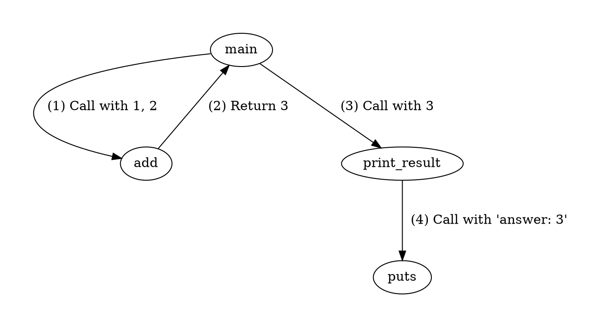
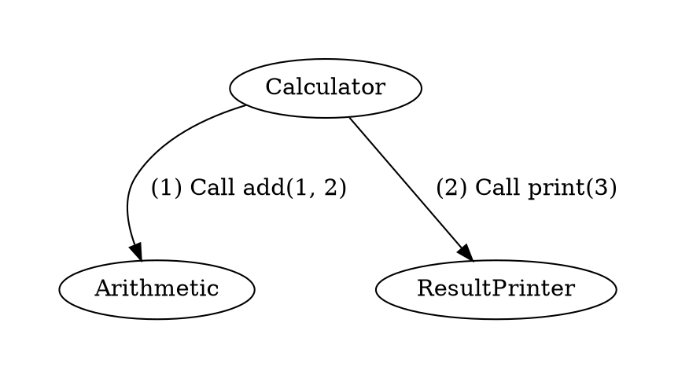

Diagramming 1
=============

## Learn To

* Diagram the following types of code
  * Imperative
  * Procedural
  * Object Oriented

## Introduction

Making software is hard. Here are a few hard tasks:

* Deciding how to solve the brief
* Deciding how to solve the problem
* Write the code to solve the problem

One way we can make it easier is to separate out these tasks. By focusing on one at a time, we reduce the number of things we have to think about at once.

We can use the technique of diagramming to think about **how to solve the problem** without having to **write the code**.

First we will practice diagramming code we already know. Then we will reverse the process to diagram a solution before we've written it.

## Exercise 1

Imperative code is like the body of a method.

We can use **trace tables** to diagram imperative code.

```ruby
i = 0
total = 0
while (i < 4)
  total += i
  i += 1
end
puts total
```

| line             | i | total     | output |
| ---------------- | - | --------- | ------ |
| `i = 0`          | 0 | undefined |        |
| `total = 0`      | 0 | 0         |        |
| `while (i < 4)`  | 0 | 0         |        |
| `total += i`     | 0 | 0         |        |
| `i += 1`         | 1 | 0         |        |
| `while (i < 4)`  | 1 | 0         |        |
| `total += i`     | 1 | 1         |        |
| `i += 1`         | 2 | 1         |        |
| `while (i < 4)`  | 2 | 1         |        |
| `total += i`     | 2 | 3         |        |
| `i += 1`         | 3 | 3         |        |
| `while (i < 4)`  | 3 | 3         |        |
| `total += i`     | 3 | 6         |        |
| `i += 1`         | 4 | 6         |        |
| `while (i < 4)`  | 4 | 6         |        |
| `puts total`     | 4 | 6         | 6      |

Pretty laborious, but it can be useful if you really need to zoom in on a method.

Try diagramming this code:

```ruby
a = 3
b = 5
a = b
puts "#{a}, #{b}"
```

## Exercise 2

Procedural code is like the methods that go inside a class.

We can use **box and arrow diagrams** to diagram procedural code.

```ruby=
def add(a, b)
  a + b
end

def print_result(num)
  puts "answer: #{num}"
end

def main
  result = add(1, 2)
  print_result(result)
end
```



We also can use **sequence diagrams** to diagram procedural code.

```sequence
main -> add: Call with 1, 2
add --> main: Return 3
main -> print_result: Call with 3
print_result -> puts: Call with 'answer: 3'
```

Note that we are being very careful here to label our arrows precisely. Many complex and important concepts in programming take the form of relationships (or arrows).

If you feel comfortable with the domain you might omit these — but if you're dealing with something tricky adding them in can clarify your thinking.

Try diagramming this code, first with a box and arrow diagram and then with a sequence diagram:

```ruby
def equal?(a, b)
  a == b
end

def expect_equal(a, b)
  if equal?(a, b)
    puts "Test passed!"
  else
    puts "Test failed!"
  end
end

def run_tests
  expect_equal(4, 4)
  expect_equal(true, false)
end
```

## Exercise 3

Object oriented code is like the code of your whole project.


We can use **box and arrow diagrams** to diagram object oriented code.

```ruby=
class Arithmetic
  def add(a, b)
    a + b
  end
end

class ResultPrinter
  def print(num)
    puts "answer: #{num}"
  end
end

class Calculator
  def run
    arithmetic = Arithmetic.new
    result_printer = ResultPrinter.new

    result = arithmetic.add(1, 2)
    result_printer.print(result)
  end
end
```



We also can use **sequence diagrams** to diagram object oriented code.

```sequence
Calculator -> Arithmetic: Call add(1, 2)
Arithmetic --> Calculator: Return 3
Calculator -> ResultPrinter: Call print(3)
Note right of ResultPrinter: Prints "answer: 3"
```

Try diagramming this code, first with a box and arrow diagram and then with a sequence diagram:

```ruby
class Diary
  def initialize
    @contents = "Eric Cantona is the best footballer!"
  end

  def read
    @contents
  end
end

class SecretDiary
  def initialize
    @diary = Diary.new
    @unlocked = false
  end

  def unlock
    @unlocked = true
  end

  def read
    return "Get out!" unless @unlocked
    @diary.read
  end
end

class User
  def run
    secret_diary = SecretDiary.new
    puts "Reading the diary..."
    puts secret_diary.read
    puts "Whops, OK... unlocking..."
    secret_diary.unlock
    puts "Trying to read again..."
    puts secret_diary.read
  end
end
```

## Exercise 4

Let's try a more realistic example. This next one may involve getting creative with your diagramming notation.

Use whichever diagram feels appropriate. Feel free to switch half way through, or do both.

```ruby
class Expect
  def initialize(value)
    @value1 = value
  end

  def to(comparison)
    if comparison.compare(@value1)
      puts "Test passed"
    else
      puts "Test failed"
    end
  end
end

class Equal
  def initialize(value)
    @value2 = value
  end

  def compare(other)
    @value2 == other
  end
end

class Tests
  def run
    Expect.new(5).to(Equal.new(5))
  end
end
```

## Exercise 5

Now let's use diagramming to illustrate programs we haven't written yet.

Diagram a program to solve the following brief. Don't write any code.

> I want a program with the following features:
>
> * The user can add a todo to a todo list
> * The user can see a list of all of their todos

## Exercise 6

And again, for this expanded brief:

> I want a program with the following features:
>
> * The user can add a todo to a todo list
> * The user can mark a todo as complete
> * The user can see all of their non-complete todos
> * The user can see all of their complete todos
