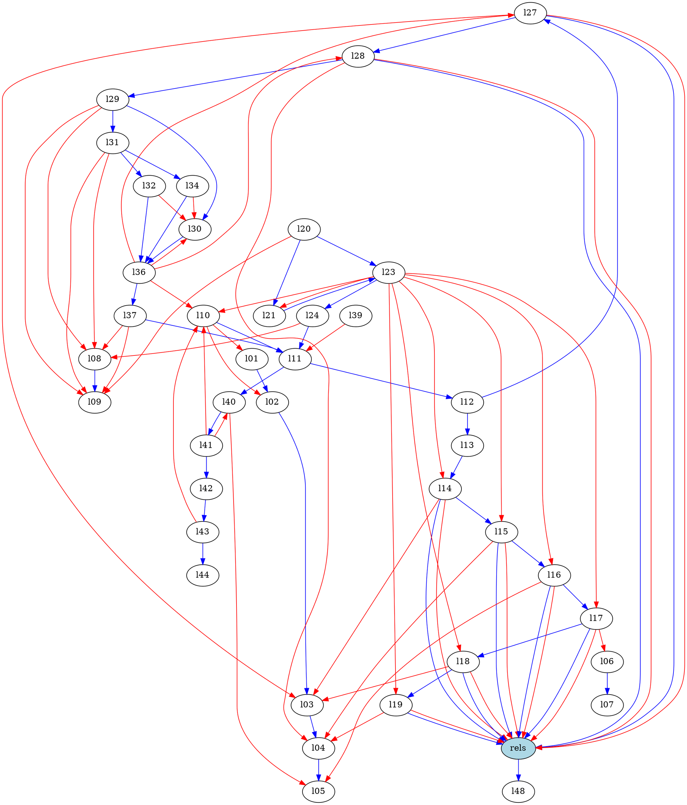
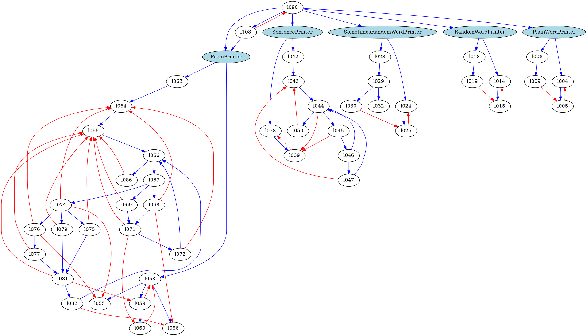

Object Oriented Code 1, Encapsulation
=====================================

## Learn to

* Encapsulate program behaviour into classes.

## Introduction

### Procedural Architecture

This is a graph of the way lines of code interact in a procedural program.

Each node is a line number. The tendrils are roughly what a developer's brain needs to keep track of when programming. What's in all the variables (red) and where the program is going next (blue).



This is, fairly obviously, super hard. Even worse — any developer could come in and add a tendril connecting any of the nodes to each other, meaning that bits of the code were dependent on each other.

So when that bit needed to change, many other things would break and programmers would spend ages tracing everything back and fixing the connections.

### Object Oriented Architecture



This is the diagram after converting the program to an Object Oriented approach. The classes are highlighted in blue.

Notice the clustering. While there is still a big messy chunk, it is all 'behind' (or 'within') the `PoemPrinter` class.

In fact, many OO (Object Oriented) languages are written so that it is impossible for any of the other nodes to connect with anything *except* by going through `PoemPrinter`. It acts as a **gatekeeper** to all the code and state inside it.

You will discover that this has many benefits.

For now, remember how we've gone from one big messy network to a number of smaller and distinct networks.


### Relatedness of methods

Take this example:

```ruby
class Note
  def initialize(title, body)
    @title = title
    @body = body
  end

  def title
    @title
  end

  def body
    @body
  end

  def display
    puts @title
    puts "---"
    puts @body
  end

  def say_hi_to_kay
    puts "Hi Kay!"
  end
end
```

Let's imagine we're plotting the 'relatedness' of each of these methods, so the most closely related nodes are closest together.

```

    * title
                 * display
      * body


                                         * say_hi_to_kay
```

Clearly `say_hi_to_kay` has nothing to do with any of the other methods.

We would re-group the methods into the following classes:

```ruby
class Note
  def initialize(title, body)
    @title = title
    @body = body
  end

  def title
    @title
  end

  def body
    @body
  end

  def display
    puts @title
    puts "---"
    puts @body
  end
end

class KayGreeter
  def say_hi_to_kay
    puts "Hi Kay!"
  end
end
```

## Exercise 1

Try drawing a **method relatedness graph** for the following examples:

```
Bank
  - get_balance
  - credit_account(date, amount)
  - debit_account(date, amount)
  - print_statement
```

```
SecretDiary
  - lock
  - unlock
  - add_entry
  - get_entries
```


## Exercise 2

Draw a **method relatedness graph** for this example:

```ruby
class Calculator
  def add(number_1, number_2)
    number_1 + number_2
  end

  def subtract(number_1, number_2)
    number_1 - number_2
  end

  def print_answer(answer)
    "The Answer is: #{ answer }"
  end
end
```

## Exercise 3

Re-group the methods in the Calculator example into the appropriate classes.

## Exercise 4

**Test-drive** the secret diary example:

```
SecretDiary
  - lock
  - unlock
  - add_entry
  - get_entries
```

**First** organise it into one class only.

**Then**, when all your tests are green, reorganise it.

This will also involve reorganising your tests!
