# Process Model Examples

Here are sequence diagrams that model the processes.

They were made using the [Mermaid Live Editor](https://mermaid-js.github.io/mermaid-live-editor) that turns text into diagrams.

The Mermaid code used to generate the images is captured here, so that these diagrams can be updated in the future.

## Home page


Mermaid code:
```
sequenceDiagram
	User->>+Browser: enter home page URL
	Browser->>+Server: GET /
	Server->>-Browser: 200 OK, HTML
	Browser->>-User: see home page
```

## Cat page



Mermaid code:
```
sequenceDiagram
	User->>+Browser: click 'a cat pic' link
	Browser->>+Server: GET /cats.html
	Server->>-Browser: 200 OK, HTML
	Browser->>+Server: GET /cat.jpg
	Server->>-Browser: 200 OK, JPEG
	Browser->>-User: see cat page
```

## Mailing list page



Mermaid code:
```
sequenceDiagram
  User->>+Browser: click 'a list' link
  Browser->>+Server: GET /list.html
  Server->>-Browser: 200 OK, HTML
  Browser->>-User: see sign up form

  User->>+Browser: enter email, click 'Submit'
  Browser->>+Server: POST /thanks.html, email
  Server->>-Browser: 200 OK, HTML
  Browser->>-User: see thanks page
```
