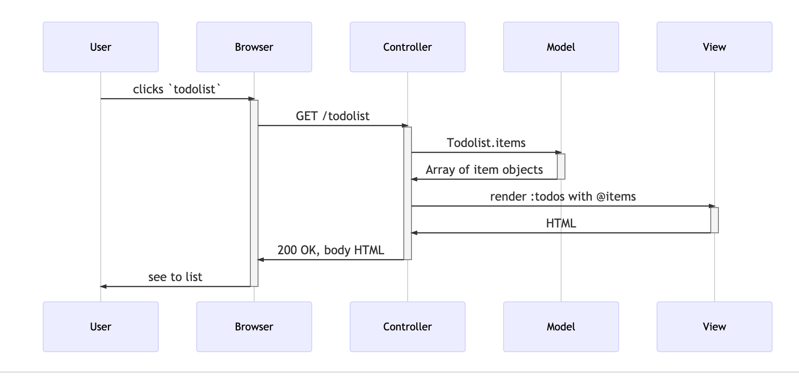

# Process modelling, applied to HTTP request/response cycle and mvc


## Learning outcomes

By the end of this session you will be able to

- Define process modelling as a tool to describe and understand a process.
- Use process modelling to further your understanding of HTTP requests and responses.
- Use process modelling to further your understanding of Model, View, Controller pattern


## Set up
Run the [to do list app](https://github.com/makersacademy/todo-list-web) on your machine by:
- Fork the repo onto your github repo
- Clone the repo onto your machine
- To run the application
  - `cd todo-list-web`
  - `ruby app.rb`

## Example: Listing all todo items


If you'd like to create a similar diagram, you can do so using [Mermaid](https://medium.com/better-programming/mermaid-create-charts-and-diagrams-with-markdown-88a9e639ab14).  The code we used to create this one is below :point_down:

```
 sequenceDiagram
	User->>+Browser: clicks `todolist`
  Browser->>+Controller: GET /todolist
  Controller->>+Model: Todolist.items
  Model->>-Controller: Array of item objects
  Controller->>+View: render :todos with @items
  View->>-Controller: HTML
  Controller->>-Browser: 200 OK, body HTML
  Browser->>-User: see to list
```  

## Exercises
* For each of the following user interactions
  - Typing in `http://localhost:4567/` to visit the home page
  - From the home page clicking on 'Add a todo list item', filling in the form and clicking submit
  - From the home page clicking on 'View to do list by category'
- Draw a sequence diagram that includes user, browser,
server, model, view and controller
- Use `httpie` to make a request on the command line and make a note of any additional insights that yields.
- Explain how data is passed from browser to server and back

## Extension
What would be the sequence if the app implemented OAuth in the case where:
- the user is not already logged in
- the user is logged in

You might find this resource helpful https://developers.google.com/identity/protocols/OAuth2