# Process Model Examples

Here are sequence diagrams that model the processes.

They were made using the [Mermaid Live Editor](https://mermaid-js.github.io/mermaid-live-editor) that turns text into diagrams.

The Mermaid code used to generate the images is captured here, so that these diagrams can be updated in the future.

## Home page



Mermaid code:
```
sequenceDiagram
	User->>+Browser: enter home page URL
	Browser->>+Server: GET /
	Server->>-Browser: 200 OK, HTML
	Browser->>-User: see home page
```

## Add item

Memaid code:
```
sequenceDiagram
	User->>+Browser: clicks `Add a todo list item`
	Browser->>+Controller: GET /add-item
	Controller->>-Browser: 200 OK, HTML
	Browser->>-User: see form
	User->>+Browser: types in form boxes,presses submit
    Browser->>+Controller: POST /add-item formdata
    Controller->>-Browser: 303 Redirect '/todolist'
    Browser->>+Controller: GET /todolist
    Controller->>+Model: Todolist.items
    Model->>-Controller: Array of item objects
    Controller->>+View: render :todos with @items
    View->>-Controller: HTML
    Controller->>-Browser: 200 OK, body HTML
    Browser->>-User: see to list
 ```